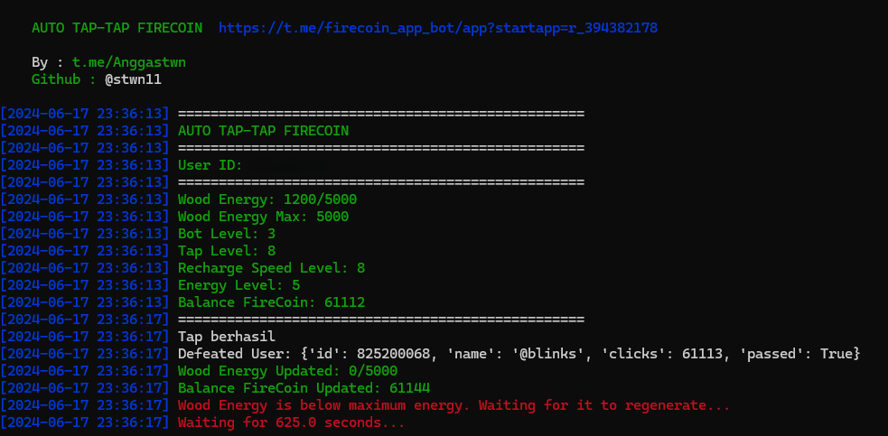

# FireCoin

Auto tap-tap for firecoin

<center>

</center>

# Table of Contents
- [FireCoinBot](#FireCoin)
- [Table of Contents](#table-of-contents)
- [Feature](#feature)
- [Registration](#registration)
- [How to Use](#how-to-use)
  - [Windows](#windows)
 - [How to Get Data](#how-to-get-data)
- [Thank you \< 3](#thank-you--3)

# Feature

- [x] Auto Tap-Tap FireCoin


# Registration

Start bot : [HERE](https://t.me/firecoin_app_bot/app?startapp=r_394382178)

# How to Use

## Windows 

1. Make sure you computer was installed python and git.
   
   python site : [https://python.org](https://python.org)
   
   git site : [https://git-scm.com/](https://git-scm.com/)

2. Clone this repository
   ```shell
   git clone git clone https://github.com/stwn11/FireCoinBot.git
   ```

3. goto FireCoinBot directory
   ```
   cd FireCoinBot
   ```

4. install the require library
   ```
   python -m pip install -r requirements.txt
   ```

5. fill the `data.txt` file with your data, how to get data you can refer to [How to Get Data](#how-to-get-data)
6. execute the main program 
   ```
   bot.exe
   ```
# How to Get Data
   
   1. Active web inspecting in telegram app ex. FireCoin apps 
   2. Goto FireCoin bot and open the apps
   3. Press `F12` on your keyboard to open devtool or right click on app and select `Inspect` and go to `Network`
   4. Search for 'loadState' go to Headers and copy data like template data.txt
    
   Example loadState telegram data

   ```
   authorization=
   baggage=
   sentry-trace=

   ```
# Thank you
